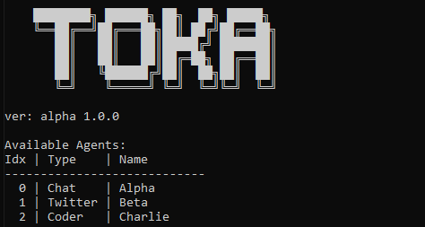

# Toka - A Modular LLM Agent Framework

<div align="center">
  
</div>

## Table of Contents

- [Overview](#overview)
- [Core Features](#core-features)
- [Quick Start](#quick-start)

## Overview

Toka is a highly extensible and secure Rust-based framework for building AI-powered agents. It provides a modular architecture that allows seamless integration of different AI models and functionalities. With Toka, users can create, export, and share agents with ease.

### Key Highlights:

- **Rust-powered security**: Memory safety and robustness
- **Pluggable agent system**: Easily extendable with new functionalities
- **Multi-LLM support** (DeepSeek, OpenAI, Claude, Grok & more)
- **Agent export and sharing**: Save and load agents as `.agent` files
- **Cross-platform** compatibility (CLI chat, Twitter)
- **Modular design** for custom solutions

## Core Features

### Agent-Based Architecture

- **Pluggable Agents**: Define different types of AI agents with distinct behaviors
- **Agent System**: Create and manage multiple AI-powered agents
- **Modular and pluggable**: Extend functionalities dynamically
- **Export and Import**: Share agents across different environments

### State & Memory Management

- **Shared State System**: Persist and retrieve agent memory
  - Context-aware conversations
  - Custom data injection for external knowledge
  - Multi-agent collaboration with shared knowledge

-  **Secure and Reliable**:
  - Memory Safety: Built with Rust to prevent common memory vulnerabilities.
  - Sandboxed Execution: Ensures agents run in isolated environments.

  - **Function Extensibility**:
  - Easy to Add New Functions: The function system allows seamless extension.
  - Flexible Function Execution: Run functions with agent context and state awareness.

### LLM Integration
- **Multiple AI Provider Support**:
  - OpenAI
  - GPT-4-Free
  - Claude
  - DeepSeek
  - Grok
- **Customizable Model Selection**
- **Easy API Key Management**

### Platform Support
- CLI-based interaction
- Built-in Twitter agent
- Future extensibility for other platforms

### API & Tooling

- **Extensible Tool System**:
  - Define and register custom tools
  - Function calling and execution support
  - Dynamic responses based on external data

### Storage Layer
- **Agent Serialization**: Export and import agents in `.agent` format
- **Stateful Execution**: Persistent agent memory

## Quick Start

1. Clone the repository:

```bash
git clone https://github.com/tokahub/Toka.git
```

2. Install dependencies:

```bash
cargo build
```

3. Examples and app expect G4F api running on Localhost:/1337

   3.1 Start [G4F](https://github.com/xtekky/gpt4free)
    ```bash
    g4f api
    ```
    3.2 Run app (Full showcase)
```bash
cargo run --bin app
```
  <div align="left">
  
  </div>
     3.3 Run example 
     
```bash
cargo run --example import_export
```

For more examples, check the `app/examples/` directory in the repository.
